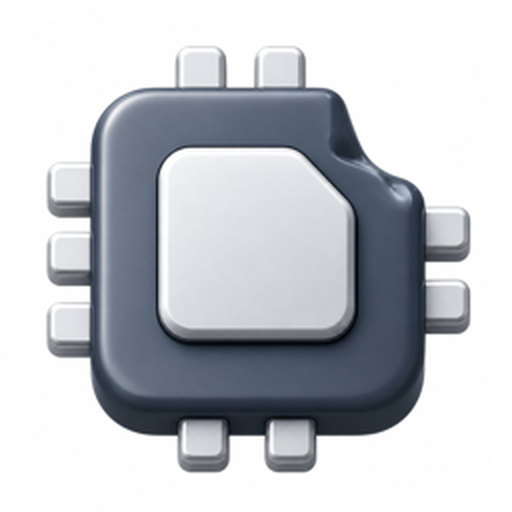

**Languages:** English | [简体中文](README.zh-CN.md)

# Mac Resource Monitor

<p align="center">
  
</p>

Mac Resource Monitor is a **macOS menu bar process table**. When the machine feels stuck, open it, see which app is using the CPU, and end that row.

It is not Stats or Activity Monitor. There is no process tree and no sensors. The process table lives in the menu bar — that icon is the only everyday entry, and it cannot be hidden.

**Requires macOS 26 or later.** Open source under the MIT License. Everything stays on your Mac — no account, no telemetry.

<p align="center">
  
</p>

## Supported platforms

- **macOS 26+** (Apple silicon and Intel)
- **Not Windows or Linux.** This app reads macOS process identity, lives in the menu bar, and ends local processes. Those APIs do not exist elsewhere.

## Install

### Homebrew (recommended)

```sh
brew tap x0c/tap
brew install --cask mac-resource-monitor
```

### Direct download

Grab the latest **signed and notarized** `Mac-Resource-Monitor-x.y.z.dmg` from the [releases](https://github.com/x0c/MacResourceMonitor/releases/latest) page, then drag Mac Resource Monitor to `/Applications`.

Mac Resource Monitor checks for updates automatically (via [Sparkle](https://sparkle-project.org)). Right-click the menu bar icon for **Check for Updates…**.

### Build from source

Requires Xcode 26+ and [XcodeGen](https://github.com/yonaskolb/XcodeGen):

```sh
git clone https://github.com/x0c/MacResourceMonitor.git
cd MacResourceMonitor
xcodegen generate
xcodebuild -project MacResourceMonitor.xcodeproj -scheme MacResourceMonitor -configuration Release \
  -destination 'platform=macOS' -derivedDataPath build/DerivedData build
rm -rf "/Applications/Mac Resource Monitor.app"
ditto "build/DerivedData/Build/Products/Release/Mac Resource Monitor.app" "/Applications/Mac Resource Monitor.app"
open "/Applications/Mac Resource Monitor.app"
```

## Usage

1. Click the menu bar dual ring (outer = CPU, inner = memory) to open the table under the icon.
2. Rows show a human name, whole-machine CPU %, physical memory %, and an end control. Click the CPU or memory header to sort that column high-to-low.
3. Hover the end control to pin that row so a refresh cannot swap it out from under the click. Click to end it.
4. Click outside the table to close it. Right-click the icon for Launch at Login, Show Network Speed, Open Main Window, Settings, Check for Updates, or Quit.
5. Launch at login is off by default. Login launches stay silent (no Settings window). The menu bar icon cannot be hidden.

## Features

- Flat table of the processes that actually matter, with human names (ChatGPT stays ChatGPT, not `node`)
- Whole-machine CPU % (capped at 100%) and physical memory %
- One-click end for your own processes; system processes stay listed but cannot be killed
- Freeze toggle (English **Freeze** / Chinese **冻结**, off by default) keeps row order steady while numbers keep updating; tapping a column header sorts and turns Freeze off; hovering End pins that row
- Network list is prewarmed in the background—no loading screen when you open it; quiet processes stay at `0 KB/s` briefly instead of flickering out
- Menu bar dual ring keeps updating even when the table is closed or frozen

## Not in scope

A Stats/iStat sensor dashboard, a dock icon, a desktop process table, an expandable process tree, Mac App Store, sandboxing, Accessibility / Full Disk Access, or Windows/Linux clients. A small recovery window after hiding the menu bar icon is required and is not a process table.

## License

[MIT](LICENSE)
