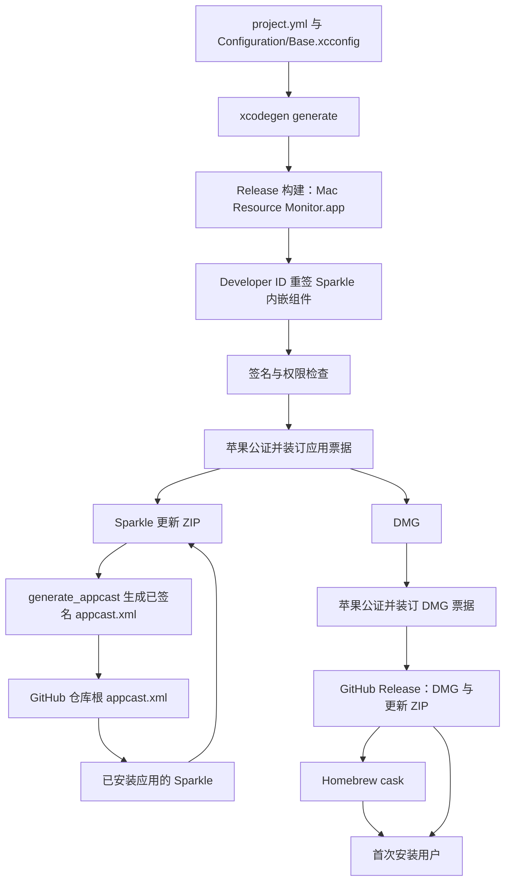

# 安装、更新与公开发布领域知识库

## §0 目录索引

| § | 标题 | 定位 |
|---|---|---|
| §1 | 业务背景与核心概念 | 首次接触安装、更新与公开发布时读 |
| §1.5 | 架构概览 | 快速建立发行与更新产物的流向 |
| §2 | 核心业务流程 | 理解首次安装、应用内更新与公开发行链路 |
| §2.5 | 物理路径速查 | 直接定位工程、版本、脚本和产物入口 |
| §3 | 本域代码入口索引 | 按工程、更新、发行任务找入口 |
| §4 | 表与字段入口索引 | 确认本域没有业务数据库 |
| §5 | 流程、组件、任务与消息入口索引 | 了解文件型发行产物与无服务端边界 |
| §6 | 核心业务规则与隐性约束 | 修改前必扫的发行边界 |
| §7 | 验证路径 | 构建、签名、安装、更新与公开可达性验证 |
| §8 | 关联文档 | 跨域修改时联读 |
| §9 | 覆盖度与待补充项 | 了解证据置信度与缺口 |

## §1 业务背景与核心概念

“安装、更新与公开发布”负责把 Mac Resource Monitor 从工程源转换为可由普通 macOS 用户安全安装、自动更新和一键安装的公开产品。它不包含日常进程采样、排序或结束逻辑；它的职责是保证这些能力进入正确签名、可被 Gatekeeper 接受、且能被后续版本替换的应用包。

产品只支持 macOS，公开源码仓是 GitHub `x0c/MacResourceMonitor`，许可证为 MIT。首次安装有两条用户路径：从 GitHub Release 下载签名并公证的 DMG，或通过 Homebrew 的 `x0c/tap` 安装 `mac-resource-monitor` cask。已经安装的应用由 Sparkle 从仓库根的 `appcast.xml` 自动检查更新，也可以从右键菜单或设置窗口主动选择“检查更新…”。

本域的主称谓固定为“安装、更新与公开发布”。其中“公开发布”不是仅推送源码或仅创建标签：它至少连通 Release 应用、Developer ID 签名、公证与票据、Sparkle 更新 ZIP 与已签名更新清单、GitHub Release、Homebrew cask，以及匿名下载检查。

版本采用双轨：面向用户的营销版本和递增的内部构建号。两者同时写在 `Configuration/Base.xcconfig` 与 `project.yml`；发布脚本在构建前比对两份来源，避免工程生成后与发布元数据不一致。

## §1.5 架构概览



图中 `project.yml` 是 Xcode 工程唯一来源；生成的 `MacResourceMonitor.xcodeproj` 只是派生产物。`Info.plist` 声明 Sparkle 的更新清单地址、更新公钥、自动检查和自动安装要求。`AppUpdater` 在进程生命周期中持有 Sparkle 控制器，`AppDelegate` 将主动检查入口接入应用，并把 Sparkle 的安装会话状态交给终止守卫。

## §2 核心业务流程

### 首次安装链路

1. 用户从 GitHub Release 取得对应版本的 `Mac-Resource-Monitor-x.y.z.dmg`，或通过 Homebrew 安装同一 Release 指向的 DMG。
2. DMG 内放置完整的 `Mac Resource Monitor.app` 与 `/Applications` 快捷方式；用户将应用放入“应用程序”。
3. 应用和 DMG 都必须经过 Developer ID 签名、公证并装订票据；首次打开的 Gatekeeper 检查必须接受应用。
4. 用户可从应用内的菜单栏入口发起更新检查；不需要账号、服务端配置或手动下载更新清单。

### 应用内更新链路

1. 应用启动时 `AppUpdater` 创建 `SPUStandardUpdaterController`，由 Sparkle 持续管理检查器。
2. `Info.plist` 的 `SUFeedURL` 指向 GitHub 公开仓根的 `appcast.xml`；自动检查、自动安装、已签名清单要求和解压前验证均由同一配置启用。
3. Sparkle 读取更新清单中的内部构建号、营销版本、更新 ZIP 地址与 EdDSA 签名，验证后下载并安装更新包。
4. 用户从右键菜单或设置窗口选择“检查更新…”时，入口汇总到 `AppDelegate.checkForUpdates()`，再调用 `AppUpdater.checkForUpdates(_:)`；Sparkle 自行展示检查和安装界面。
5. 更新安装会话进行中，`AppDelegate` 将 `SPUUpdater.sessionInProgress` 交给 `TerminationGuard`。常规关闭保护继续生效，但更新所需终止必须被放行，否则安装无法完成。

### 公开发行链路

1. 在 `Configuration/Base.xcconfig` 和 `project.yml` 同步设置营销版本与内部构建号；脚本先检查两份数值一致且内部构建号为正整数。
2. `publish-release.sh` 生成 Xcode 工程并执行 Release 构建，然后以 Developer ID 对 Sparkle 的 XPC 服务、更新器、自动更新程序、框架和应用按由内到外的顺序重新签名。
3. 脚本检查签发者、时间戳、加固运行时和调试权限，随后公证应用并装订应用票据。
4. 脚本打出更新 ZIP，用 Sparkle 工具生成并验证 `appcast.xml`：更新地址指向本次 GitHub Release，版本说明内嵌，清单带 EdDSA 签名。
5. 脚本从已公证的应用创建 DMG，公证并装订 DMG；本地通过 Gatekeeper 与票据校验后才进入远端步骤。
6. 非 `--local-only` 模式将当前树的干净快照推送到 GitHub，先创建空 Release，再上传 DMG 和更新 ZIP；随后更新 Homebrew cask，并匿名下载更新清单与两个附件做终检。

发布脚本对公开更新清单和 Homebrew 配方都有版本回退保护。公开仓远端传输失败不等于本地签名或公证失效：应从公开快照、Release、cask 或匿名终检的失败环节续跑，不重新公证已经通过的同一产物。

**【排错】并发发版与 raw CDN 终检** → 全局权威：

→ [macos-signing-notarization-distribution.md](/Users/geraltgraham/Codes/_standards/workspace-docs/swift-docs/macos-signing-notarization-distribution.md)「同一工作树禁止并行发版；raw CDN 滞后不是回滚信号」

本仓脚本名：`scripts/publish-release.sh`。产物目录与互斥按该文执行。

## §2.5 物理路径速查

| 目录或文件（相对项目根） | 内容 | 关键类或文件 |
|---|---|---|
| `project.yml` | XcodeGen 工程定义、Swift Package、Release 签名和版本配置 | `MacResourceMonitor` target、Sparkle 依赖 |
| `Configuration/Base.xcconfig` | Bundle 标识、团队、营销版本和内部构建号 | 版本双轨的一侧 |
| `Configuration/Release.xcconfig` | Release 构建覆盖设置 | Release 配置文件 |
| `MacResourceMonitor/Info.plist` | Sparkle 更新地址、更新公钥与自动更新要求 | `SUFeedURL` 等键 |
| `MacResourceMonitor/App/AppUpdater.swift` | Sparkle 控制器的生命周期与主动检查入口 | `AppUpdater` |
| `MacResourceMonitor/AppDelegate.swift` | 更新入口与更新期间终止放行的接线 | `AppDelegate.checkForUpdates()` |
| `MacResourceMonitor/StatusItem/StatusItemController.swift` | 右键菜单“检查更新…”动作的转发 | `StatusItemController.checkForUpdates(_:)` |
| `MacResourceMonitor/Views/SettingsView.swift` | 设置窗口里的“检查更新…”按钮 | `SettingsView` |
| `scripts/publish-release.sh` | 本地构建、签名、公证、发布与匿名终检 | `notarize_and_wait()`、`push_github_snapshot()` |
| `scripts/publish-local.env.example` | 未入库的发行凭据配置模板 | 本地发行配置样例 |
| `appcast.xml` | Sparkle 公开更新清单 | 更新版本条目 |
| `README.md` | 英文用户安装说明 | `Install` |
| `README.zh-CN.md` | 简体中文用户安装说明 | `安装` |
| `docs/PRODUCT_CONTRACT.md` | 对外分发的产品边界 | `权限与分发` |
| `AGENTS.md` | 工程来源、覆盖安装和发行约束 | `构建与覆盖安装` |

`TerminationGuard` 由 `MacKitLifecycle` Swift Package 提供，当前仓内没有同名源码文件；本域只依赖它在 `AppDelegate` 中的更新会话接线，不把第三方包实现当作本仓发行逻辑修改。

## §3 本域代码入口索引

| 场景 | 入口 | 类、方法或配置 | 说明 |
|---|---|---|---|
| 改工程结构、Swift Package、签名或 Release 构建设置 | `project.yml` | `settings.configs.Release`、`packages.Sparkle` | 这是唯一工程来源；改后必须生成工程，不手改派生工程。 |
| 改公开版本或内部构建号 | `Configuration/Base.xcconfig` 与 `project.yml` | `MARKETING_VERSION`、`CURRENT_PROJECT_VERSION` | 两处必须同步；脚本会在构建前中止不一致发布。 |
| 改自动检查、更新清单地址或更新验证要求 | `MacResourceMonitor/Info.plist` | `SUFeedURL`、`SUPublicEDKey`、`SUEnableAutomaticChecks`、`SUAutomaticallyUpdate`、`SURequireSignedFeed`、`SUVerifyUpdateBeforeExtraction` | 这些键决定已安装应用从哪里取清单及其安全边界。 |
| 改 Sparkle 生命周期或主动检查行为 | `MacResourceMonitor/App/AppUpdater.swift` | `AppUpdater.init()`、`AppUpdater.checkForUpdates(_:)` | 必须长期持有控制器，菜单入口只委托 Sparkle，不重写其安装流程。 |
| 改更新期间的退出策略或检查入口接线 | `MacResourceMonitor/AppDelegate.swift` | `applicationDidFinishLaunching(_:)`、`applicationShouldTerminate(_:)`、`checkForUpdates()` | 将更新会话状态交给终止守卫，并把用户操作转给 `AppUpdater`。 |
| 改右键入口文字或事件转发 | `MacResourceMonitor/StatusItem/StatusItemController.swift` | `StatusItemController.checkForUpdates(_:)` | 用户可见入口属于菜单栏域；此处只确认它最终转发到更新动作。 |
| 改设置窗口的检查入口 | `MacResourceMonitor/Views/SettingsView.swift` | 更新按钮动作 | 同样调用 `AppDelegate.checkForUpdates()`。 |
| 改完整发行步骤 | `scripts/publish-release.sh` | `notarize_and_wait()`、`push_github_snapshot()` | 串联签名、公证、Release、cask 和匿名终检；凭据只从未入库的本地环境文件读取。 |
| 改公开更新内容 | `appcast.xml` | Sparkle item 与签名尾部 | 必须由 Sparkle 工具生成和验证，不能手改后直接发布。 |
| 改用户安装路径或安装说明 | `README.md`、`README.zh-CN.md` | Install / 安装段 | 英文说明为权威安装结构，中文说明保持同等渠道与边界。 |

## §4 表与字段入口索引

本域没有业务数据库、数据表、迁移、查询或持久化字段。版本、更新清单和发行描述是随源码发布的文件型元数据，不可把它们误当作数据库状态。

| 表或字段 | Entity/Mapper | 业务语义 | 改动注意 |
|---|---|---|---|
| 不适用 | 不适用 | Mac Resource Monitor 是纯本地 macOS 工具；安装、更新与公开发布不依赖业务数据库 | 不为版本、Release 或更新清单新建服务端表。 |

## §5 流程、组件、任务与消息入口索引

本域没有 MQ、后台服务端任务、定时服务或服务端工作流。所有发行状态由本地脚本、GitHub Release、仓库根更新清单和 Homebrew cask 组成；GitHub 与 Apple 公证是外部平台，不应被描述为本项目自建服务。

| 类型 | 标识 | 代码或文件入口 | 适用场景 |
|---|---|---|---|
| 本地发行流程 | 完整发行 | `scripts/publish-release.sh` | 有发行凭据且要完成本地与公开发布链路时。 |
| 本地发行流程 | 仅本地产物 | `scripts/publish-release.sh --local-only` | 只验证构建、签名、公证和 DMG，不提交、不推送、不创建 Release 时。 |
| 文件型更新产物 | Sparkle 更新清单 | `appcast.xml` | 已安装应用发现、验证并下载更新时。 |
| 文件型安装产物 | DMG | GitHub Release 附件 | 第一次直接安装时。 |
| 文件型更新产物 | 更新 ZIP | GitHub Release 附件 | Sparkle 下载与安装更新时。 |
| 外部配方仓 | Homebrew cask | `x0c/homebrew-tap` 的 `Casks/mac-resource-monitor.rb` | 用户通过 Homebrew 一键安装或升级时。 |

## §6 核心业务规则与隐性约束

**跨产品权威**：Developer ID / 加固运行时 / Sparkle 内嵌重签 / 版本双轨 / 空 Release 再传附件 / 并发发版互斥 / raw CDN 终检滞后 / `--local-only` → `~/Codes/_standards/workspace-docs/swift-docs/macos-signing-notarization-distribution.md`；开源门面与 Homebrew → `~/.config/agentsync/docs/OPEN_SOURCE_GITHUB_GUIDE.md`；商店 vs 官网公证分工 → `~/.config/agentsync/docs/APP_STORE_CHINA_LISTING_GUIDE.md` §3.1。本节约本仓接线。

- 【必须】Xcode 工程只改 `project.yml`，改后 XcodeGen 重生（`MacResourceMonitor.xcodeproj` 是派生产物）。
- **AI 易错点** 营销版本与内部构建号须同步改 `Configuration/Base.xcconfig` 与 `project.yml`（脚本会拦不一致）。
- **AI 易错点** 禁止用 Debug / ad-hoc 覆盖 `/Applications` 里的 Developer ID 包；覆盖安装先删再整包 `ditto`（见 swift 基线）。
- 【接线】`AppUpdater` 长期持有 Sparkle 控制器；`AppDelegate` 把 `sessionInProgress` 交给 `TerminationGuard`；右键/设置「检查更新…」只转发，不重写安装流程。
- 【禁止】手改已签名 `appcast.xml`；必须用本仓 `scripts/publish-release.sh` 调用的 Sparkle 工具生成并校验。
- 【必须】公开快照走 `push_github_snapshot()`，禁止把私有 origin 历史/内网地址推到 `x0c/MacResourceMonitor`；发布前按公开仓规则做泄漏扫描。
- 【必须】公开 appcast 与 Homebrew cask `x0c/tap` 的 `mac-resource-monitor` 不得回退版本（脚本已检）。
- 【禁止】为更新/安装新增账号、遥测、服务端任务、Mac App Store、沙盒、辅助功能或完整磁盘访问。
- 【叫法】“安装、更新与公开发布”覆盖 DMG、Sparkle、GitHub Release 和 Homebrew；`AppUpdater` / `appcast.xml` / `publish-release.sh` / cask 是入口名，不是四个独立业务域。

## §7 常见易忽略条件与验证路径

以下命令在 `app-macos` 项目根执行。它们验证当前工作树或明确指定的产物；除非另行说明，不宣称已经完成 Apple 公证、GitHub 上传或远端发行。

1. 改工程设置、依赖或版本后，先重新生成工程并做 Release 构建：

   ```bash
   xcodegen generate && xcodebuild -project MacResourceMonitor.xcodeproj -scheme MacResourceMonitor -configuration Release -destination 'platform=macOS' -derivedDataPath build/DerivedData build
   ```

   检查构建结束并产出 `build/DerivedData/Build/Products/Release/Mac Resource Monitor.app`。此命令不等于完成 Developer ID 签名或公证。

2. 改版本后，先核对双轨版本是否一致，避免把不一致留到长时间构建之后才失败：

   ```bash
   printf 'xcconfig: '; awk -F' = ' '/^(MARKETING_VERSION|CURRENT_PROJECT_VERSION) = / { print $1 "=" $2 }' Configuration/Base.xcconfig; printf 'project: '; awk -F': ' '/^[[:space:]]*(MARKETING_VERSION|CURRENT_PROJECT_VERSION): / { gsub(/^[[:space:]]*/, "", $1); print $1 "=" $2 }' project.yml
   ```

   两种文件中每个同名值必须相同，内部构建号必须为正整数。

3. 对已有 Release 应用验证签名主体、加固运行时和 Gatekeeper 接受状态：

   ```bash
   app_path='build/DerivedData/Build/Products/Release/Mac Resource Monitor.app'; codesign -dv --verbose=2 "$app_path" 2>&1; spctl -a -vvv -t install "$app_path"
   ```

   检查输出含 Developer ID 签发者、runtime 标志与 `accepted`。若该产物不是本次完整发行产物，不能据此推断 DMG 已公证。

4. 对已有 DMG 验证装订票据：

   ```bash
   xcrun stapler validate 'build/Mac-Resource-Monitor-<版本>.dmg'
   ```

   将 `<版本>` 替换为实际营销版本。成功只说明指定本地 DMG 的票据可验证，不证明 GitHub 已上传。

5. 对已有更新清单做结构检查；若本机具备 Sparkle 签名账号，再由发行脚本调用其验证工具验证签名：

   ```bash
   xmllint --noout appcast.xml && rg 'sparkle:edSignature=' appcast.xml
   ```

   XML 合法和存在签名字段只是基础检查；完整 EdDSA 验证需要本机已有发行凭据，不能在没有凭据时伪造通过。

6. 覆盖安装必须使用完整 Release 包，先移除旧包再复制并启动：

   ```bash
   rm -rf '/Applications/Mac Resource Monitor.app' && ditto 'build/DerivedData/Build/Products/Release/Mac Resource Monitor.app' '/Applications/Mac Resource Monitor.app' && open '/Applications/Mac Resource Monitor.app'
   ```

   仅在确认目标目录可无交互写入时执行；若系统要求管理员授权，停止而不要弹出图形授权。启动后需从菜单栏确认实际运行版本和“检查更新…”入口可用。

7. 完整公开发行或仅本地产物的流程由 `scripts/publish-release.sh` 执行。它需要本机 Developer ID 证书、Apple 公证凭据和 Sparkle 签名账号；完整发行还需要 GitHub 登录与相应仓库权限。只有这些凭据真实可用时，才可运行下列流程：

   ```bash
   scripts/publish-release.sh --local-only
   ```

   `--local-only` 仍会提交 Apple 公证，但不提交 Git、不推送 GitHub、不创建 Release 或更新 Homebrew。完整发行后还必须以脚本的匿名下载终检确认公开 `appcast.xml`、更新 ZIP 和 DMG 可达。

## §8 关联文档

- [PRODUCT_CONTRACT.md](PRODUCT_CONTRACT.md)：涉及公开分发边界、支持平台、签名公证、Sparkle、Homebrew、安装说明或用户可见“检查更新…”时联读；该文档是产品体验与公开渠道裁定的权威来源。
- [MENU_BAR_INTERACTION_KNOWLEDGE_BASE.md](MENU_BAR_INTERACTION_KNOWLEDGE_BASE.md)：涉及右键“检查更新…”入口、设置窗口入口或更新安装期间的退出例外时联读。若该文档尚未生成，以 `AppDelegate`、状态项和设置窗口入口为当前代码证据。
- [PROCESS_MONITORING_AND_TERMINATION_KNOWLEDGE_BASE.md](PROCESS_MONITORING_AND_TERMINATION_KNOWLEDGE_BASE.md)：改安装产物中承载的核心进程表能力时可联读；本域不改变采样与结束策略。若该文档尚未生成，以产品契约和核心代码为准。
- [AGENTS.md](../AGENTS.md)：涉及工程来源、覆盖安装、公开仓脱敏或发布步骤时联读。

## §9 覆盖度与待补充项

- 代码推断覆盖：已覆盖 XcodeGen 工程来源、双轨版本、Release 签名设置、Sparkle 配置与入口、更新期间终止放行接线、DMG 与更新 ZIP 生成、公开快照、GitHub Release、Homebrew cask 和匿名终检步骤。
- 领域语言统一：主称谓为“安装、更新与公开发布”；`AppUpdater`、`appcast.xml`、`publish-release.sh`、DMG 和 cask 均作为实现或产物名使用，没有已确认的同名异义。
- 用户与资料补充：用户明确没有额外资料、历史经验或自定义验收口径；本文件未伪造真实发行事故或实际验收结果。
- 多源证据补强：已读取工程定义、版本配置、应用更新配置与入口、发行脚本、更新清单、双语安装说明、产品契约和工程约束。Git 历史只说明发行相关文件曾变化，是弱信号，不作为当前发布状态证据。
- Q&A 补充：用户经验缺失；本次依据现有代码与文档建立入口和验证路径，不推断未在仓内体现的 Apple 或 GitHub 操作细节。
- 待补充：当前运行状态、已安装应用版本、远端 GitHub Release、Homebrew cask、在线 `appcast.xml`、Developer ID 签名、公证票据和匿名下载状态均未在本次验证，必须在每次发行时重新核验。历史发行证据可能过时，不能当作当前有效性结论。

<!-- 该文档整理/压缩于 2026-09-05 -->
