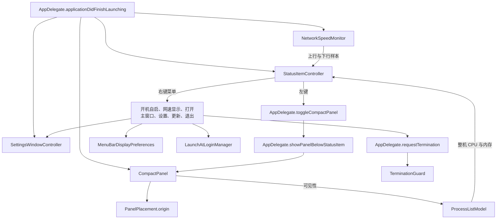

# 菜单栏操作与恢复领域知识库

## §0 目录索引

| § | 标题 | 定位 |
|---|---|---|
| §1 | 业务背景与核心概念 | 首次接触菜单栏操作与恢复时读 |
| §1.5 | 架构概览 | 先看显示、浮层和恢复窗口如何协作 |
| §2 | 核心交互流程 | 理解左键、右键、登录静默、设置窗与退出的转换 |
| §2.5 | 物理路径速查 | 需要直接定位实现时读 |
| §3 | 代码入口索引 | 按改动场景找入口 |
| §4 | 表与字段入口索引 | 确认是否涉及持久化表时读 |
| §5 | 流程、组件、任务与 MQ 入口索引 | 改生命周期、绘制刷新或采样时读 |
| §6 | 核心业务规则与隐性约束 | 写代码前必扫，避免破坏已锁体验 |
| §7 | 验证路径 | 改完后执行自动与人工验收 |
| §8 | 关联文档 | 涉及进程数据或更新发布时联读 |
| §9 | 覆盖度与待补充项 | 了解证据边界与尚未验证的行为 |

## §1 业务背景与核心概念

**菜单栏操作与恢复**是 CPU Killer 的唯一日常入口。它让用户在菜单栏中持续看到整机占用概览，需要结束进程时才左键展开短暂的进程表；需要改变应用行为时，才通过右键菜单或「打开主窗口」出示的设置窗操作。图标即主入口，**禁止隐藏菜单栏图标**。它不是第二个桌面工作区，也不是始终悬挂在状态项上的系统菜单。

本领域只负责把进程监控域提供的整机 CPU、整机物理内存和面板可见性消费为菜单栏体验；不决定进程怎样识别、怎样采样、哪些进程可结束，也不定义签名、公证或 Release 产物。检查更新只在这里提供入口和更新会话期间的退出边界，更新传输与发布细节属于发布域。

核心概念如下：

| 主称谓 | 实现别名或载体 | 用户可感知语义 |
|---|---|---|
| 菜单栏操作与恢复 | `StatusItemController`、`AppDelegate` | 左右键分工、图标常驻、登录静默、设置窗与退出边界的完整链路 |
| 菜单栏双环 | `MenuBarIconRenderer` | 外环是整机 CPU，内环是系统级物理内存；两环持续刷新，不受列表冻结影响 |
| 两行网速块 | `NetworkSpeedMonitor`、`NetworkRateFormatter`、`MenuBarDisplayPreferences` | 双环旁的上行/下行读数；可隐藏显示但不能停止采样 |
| 进程表浮层 | `CompactPanel` | 左键临时展开的无标题栏面板；点外关闭，不能作为隐藏图标后的恢复入口 |
| 锚定定位 | `PanelPlacement` | 把进程表放在真实状态项正下方；不能把无效坐标当锚点 |
| 设置窗 / 打开主窗口 | `SettingsWindowController`、`SettingsView` | 带标题栏的偏好窗；不是藏图标恢复面（产品禁止藏图标） |
| 开机自启三态 | `LaunchAtLoginManager`、`LaunchAtLoginStatus` | 开、关、待批准；待批准不是已打开 |
| 登录静默判定 | `LoginLaunchDetector`、`MenuBarReopenPolicy` | 登录项拉起时不自动弹设置窗 |
| 显示偏好 | `MenuBarDisplayPreferences` | 仅保存网速读数是否显示，默认显示；图标始终可见 |
| 退出守卫 | `TerminationGuard` | 平常拒绝系统的顺手退出；仅更新安装会话允许退出 |

产品面向中英文用户，界面文字以本地化资源为准。用户看见的是“菜单栏操作与恢复”，文档不把它改称为“状态栏模块”“弹窗层”或其他代码目录名。

## §1.5 架构概览



关键分层：

1. `AppDelegate.applicationDidFinishLaunching()` 组装所有面向菜单栏的对象，接进程监控数据、接网速采样；用 `LoginLaunchDetector` 判定登录拉起，登录时绝不自动弹设置窗。
2. 两个独立状态项各自的系统按钮是左右键分流点；圆环项始终可见，网速项仅受「显示网速」控制；`StatusItemController` 管理右键菜单与重绘。
3. `CompactPanel.show()` 与 `CompactPanel.hidePanel()` 管理临时表的显示、可见性回传与点外关闭；`PanelPlacement.origin()` 只根据真实状态项框进行锚定。
4. `SettingsWindowController.show()` 提供独立、带标题栏且保存位置的设置窗（打开主窗口 / 设置）；它与进程表浮层有意分开。
5. `NetworkSpeedMonitor.start()` 和 `MenuBarIconRenderer.image()` 形成内存内的采样—绘制链路；显示开关只改变绘制宽度和读数，不改变采样链路。

## §2 核心交互流程

### 路径一：正常启动并显示菜单栏图标

1. `AppDelegate.applicationDidFinishLaunching()` 清除历史 `menuBar.iconVisible`，创建 `CompactPanel` 和 `StatusItemController`，注入左键、打开主窗口、设置、检查更新和退出的回调（无隐藏回调）。
2. 同一启动入口把 `ProcessListModel.setMetricsObserver()` 接到 `StatusItemController.updateMetrics()`，把 `NetworkSpeedMonitor.setObserver()` 接到 `StatusItemController.updateNetworkSpeed()`，随后由 `NetworkSpeedMonitor.start()` 启动一秒一拍的网速采样。
3. `StatusItemController.configureButton()` 让状态项接收左右键抬起事件，关闭系统蓝色焦点环，并首次绘制零值双环。
4. 圆环状态项强制可见；网速状态项仅跟 `MenuBarDisplayPreferences.showsNetworkSpeed`。
5. 读取 `LoginLaunchDetector.isLaunchedAsLoginItem`，仅当 `MenuBarReopenPolicy.shouldShowRecoveryWindow(iconVisible:true, isLoginLaunch:)` 为真才弹设置窗——图标常驻时该调用在登录与否下均为假，保证登录静默。应用常驻为菜单栏应用，最后一个普通窗口关闭也不退出。

### 路径二：左键打开、定位并关闭两张表

1. 用户左键状态项：圆环项直接打开 CPU / 内存表，网速项直接打开网络表并默认按 Download 排序；两项没有互相转换的坐标分支。左键不挂系统菜单，也不能退化成菜单。
2. 若同一张表已显示，`CompactPanel.hidePanel()` 收起它；若点了另一张表，`CompactPanel.switchContent(to:)` 直接切换；若未显示，`AppDelegate.showPanelBelowStatusItem(content:attempt:)` 读取 `StatusItemController.buttonScreenFrame()`。
3. 只有 `PanelPlacement.isMenuBarAnchor()` 认定为真实菜单栏状态项框时才调用 `CompactPanel.show(anchor:content:)`。坐标尚未就绪时，`AppDelegate.showPanelBelowStatusItem(content:attempt:)` 会短暂重试；重试用尽才交给 `PanelPlacement.origin()` 的安全居中上边回退，绝不把零坐标当作屏幕左下角位置。
4. `CompactPanel.position(near:)` 通过 `PanelPlacement.origin()` 把表以图标中心为水平中心、紧贴菜单栏下方；位于底部菜单栏的屏幕时则向可见区域内侧展开，并将位置夹在可见屏幕边界内。
5. `CompactPanel.show()` 安装全局与本地鼠标按下监视器，同时经 `onVisibilityChange(true)` 通知进程监控域可以刷新列表。面板内点击不关闭；状态项框被加入保留区域，点原图标也不关闭；其他地方点击由 `PanelDismiss.shouldHide()` 判定后收起。
6. `CompactPanel.hidePanel()` 移除两类监听器、隐藏窗口并经 `onVisibilityChange(false)` 通知列表停止更新；菜单栏双环、表头所依赖的整机指标和网速采样仍独立更新。

### 路径三：右键菜单与偏好改变

1. 用户右键，或按住 Control 点击：状态项按钮经 `sendAction(on: [.leftMouseUp, .rightMouseUp])` 收到抬起事件后，临时把 `NSMenu` 挂到该项再 `performClick`，随后立刻卸掉；左键没有常挂菜单，因此不会被系统菜单劫持。
2. `StatusItemController.menuNeedsUpdate()` 每次打开菜单先刷新开机自启状态，再把开、关、待批准映射为勾选、未勾选、中间态；仅待批准时显示跳转到系统登录项的入口。
3. 选择“显示网速”时，`StatusItemController.toggleNetworkSpeed()` 改 `MenuBarDisplayPreferences.showsNetworkSpeed` 并重绘。该偏好进入本机默认值，下次启动仍有效。
4. 选择开机自启时，`StatusItemController.toggleLaunchAtLogin()` 先刷新实际状态，再经 `LaunchAtLoginManager.setEnabled()` 请求切换；已处于待批准而用户仍想开时，引导系统设置而不是假装成功。
5. 选择设置、打开主窗口、检查更新或退出时，分别进入 `AppDelegate.showSettings()`、`AppDelegate.showRecoveryWindow()`、`AppDelegate.checkForUpdates()`、`AppDelegate.requestTermination()`。它们不是进程表的替代入口。

**【排错结论 2026-09-07】右键菜单栏图标完全没反应**：拆成双状态项时曾改用 `NSClickGestureRecognizer(buttonMask: 右键)` + `popUpMenu`。状态栏按钮会吞掉右键，该手势在不少机器上永远进不了 `.ended`，表现为右键零反馈、左键仍正常。必须改回 `sendAction(on: [.leftMouseUp, .rightMouseUp])`，按 `NSApp.currentEvent` 分流，右键临时挂菜单再 `performClick` 后卸掉。禁止再对手势识别器赌右键；跨产品同构见全局菜单栏指南。

### 路径四：设置窗与登录静默（禁止藏图标）

1. **【裁定 2026-09-05】** 产品禁止隐藏菜单栏图标：右键无「隐藏菜单栏图标」，设置无「显示菜单栏图标」，不持久化图标显隐。
2. 用户主动选「打开主窗口」或「设置」时，`SettingsWindowController.show()` 出示带标题栏窗口：仍在工作、开机自启、检查更新；位置用保存名恢复。
3. 登录项拉起：`LoginLaunchDetector.isLaunchedAsLoginItem == true` 时，`MenuBarReopenPolicy` 返回不弹窗；禁止 `showRecoveryWindow` / `SettingsWindowController.show`。
4. 用户从应用程序 / Spotlight 再次打开时：按全局【裁定 2026-09-07】，本产品属菜单栏即主入口——就绪后默认 60 秒内 reopen 须出设置窗（`menubarIsPrimaryEntry: true` + `secondsSinceReady`），**与图标始终可见无关**；超时且图标可见可不自动弹窗。登录拉起仍静默。设置窗须含右键对等能力（含**检查更新**）。
5. 关闭设置窗只结束窗口激活会话，不退出应用。

### 路径五：持续绘制、网速显示与退出例外

1. 进程监控域每次给出整机指标时，`StatusItemController.updateMetrics()` 保存 CPU/内存并调用 `renderStatusItem()`；网速样本由 `StatusItemController.updateNetworkSpeed()` 走同一重绘路径。
2. `MenuBarIconRenderer.image()` 固定绘制同心双环：外环消费 CPU、内环消费物理内存。显示网速时，同一图像中在双环旁绘制两行读数；关闭显示仅让该块消失，双环和 `NetworkSpeedMonitor` 都不停。
3. `NetworkSpeedMonitor` 只读取默认路由接口；接口变更时 `NetworkSpeedMonitor.setDefaultInterface()` 清除基线并先报告空读数，后续采样重新建立基线，不能把多个接口或旧接口累加。
4. 用户请求退出时 `AppDelegate.applicationShouldTerminate()` 询问 `TerminationGuard.shouldTerminate()`。关闭最后窗口和系统顺手退出都要取消；只有更新安装会话中的退出请求能通过。

### 交互状态与允许转换

该领域没有需要落库的业务状态机，但有必须同时维持的本机交互状态。不要把它们压缩成单一“应用已打开”布尔值；每一列有不同的责任边界。

| 状态面 | 典型值 | 谁改变它 | 允许的用户后果 | 不允许的推断 |
|---|---|---|---|---|
| 菜单栏图标 | 始终显示 | 启动强制可见；无显隐偏好 | 可左键打开表 | 禁止隐藏；登录静默不弹设置窗 |
| 进程表浮层 | 显示 / 收起 | `CompactPanel.show()`、`CompactPanel.hidePanel()` | 显示时用户可结束进程；收起时点外关闭已完成 | 收起不等于菜单栏双环、表头或网速停止刷新 |
| 列表刷新 | 开 / 冻结 | 进程监控域的刷新偏好 | 冻结名单以便安全点击结束 | 冻结不等于冻结整机指标、双环或网速采样 |
| 网速读数 | 显示 / 隐藏 | `MenuBarDisplayPreferences.showsNetworkSpeed` | 隐藏时节省菜单栏宽度 | 隐藏不等于取消默认路由监控或重置双环 |
| 网速样本 | 无样本 / 有样本 | `NetworkSpeedMonitor.setDefaultInterface()`、`NetworkSpeedMonitor.sample()` | 无样本显示破折号，下一次有效采样恢复数字 | 接口变化后的无样本不是零流量，也不能沿用旧读数 |
| 开机自启 | 关 / 开 / 待批准 | `LaunchAtLoginManager.setEnabled()` 与系统登录项 | 待批准时给出系统设置入口 | 待批准不是开；菜单勾选不能显示为普通已开启 |
| 恢复窗口 | 未显示 / 已显示 | `SettingsWindowController.show()`、用户关闭窗口 | 已显示时可找回图标与偏好 | 关闭窗口不等于应用要终止 |
| 退出许可 | 拒绝 / 更新会话放行 | `TerminationGuard` 与应用内更新会话 | 更新安装可按需要结束应用 | 图标隐藏、无普通窗口、用户误点关闭都不是放行理由 |

关键转换表：

| 起点 | 触发 | 必经入口 | 终点 | 必须保持不变 |
|---|---|---|---|---|
| 图标显示、表收起 | 左键 | 独立点击层 → `AppDelegate.showPanelBelowStatusItem()` | 对应表显示 | 圆环层只进 CPU/内存，网速层只进网络表；右键菜单不常挂；网速与双环继续刷新 |
| 图标显示、表显示 | 左键 | `AppDelegate.toggleCompactPanel()` → `CompactPanel.hidePanel()` | 表收起 | 图标仍显示；应用不退出 |
| 图标显示、表显示 | 点击面板外 | `CompactPanel.handleOutsideMouseDown()` → `PanelDismiss.shouldHide()` | 表收起 | 点击面板内或状态项不能触发此转换 |
| 图标显示 | 用户主动打开主窗口 / 设置 | `AppDelegate.showSettings()` | 设置窗显示 | 登录拉起不得走此路径 |
| 图标显示 | 登录项拉起 | `LoginLaunchDetector` + `MenuBarReopenPolicy` | 零窗口，后台就绪 | 禁止自动弹设置窗 |
| 网速显示 | 右键取消勾选 | `StatusItemController.toggleNetworkSpeed()` | 网速隐藏 | `NetworkSpeedMonitor.start()` 不被停止，双环不变化 |
| 无网速样本 | 默认出口接口变化 | `NetworkSpeedMonitor.setDefaultInterface()` | 清基线、显示破折号 | 不能合并旧接口累计字节，也不能将无样本当零 |
| 待批准开机自启 | 菜单或设置窗再次要求开启 | `LaunchAtLoginManager.setEnabled()` | 打开系统登录项设置 | 不能直接把状态转成“开” |
| 普通运行 | 关闭最后窗口或系统请求终止 | `AppDelegate.applicationShouldTerminateAfterLastWindowClosed()`、`AppDelegate.applicationShouldTerminate()` | 应用继续运行 | 除非更新安装会话，否则不能结束 |

## §2.5 物理路径速查

| 目录（相对项目根） | 内容 | 关键类或文件 |
|---|---|---|
| `CPUKiller/` | 应用生命周期、对象组装、唤回和退出决策 | `AppDelegate.swift` |
| `CPUKiller/StatusItem/` | 状态项、动态双环和网速绘制、浮层、锚定、点外关闭 | `StatusItemController.swift`、`CompactPanel.swift`、`PanelPlacement.swift`、`PanelDismiss.swift`、`MenuBarIconRenderer.swift` |
| `CPUKiller/App/` | 显示偏好、设置窗、开机自启的应用层入口 | `AppPreferences.swift`、`SettingsWindowController.swift`、`LaunchAtLoginManager.swift` |
| `CPUKiller/Views/` | 恢复窗口与两张平表、无蓝框焦点呈现 | `SettingsView.swift`、`ProcessTableView.swift`、`NetworkTableView.swift` |
| `CPUKiller/Services/` | 默认出口网卡、总网速与按进程网络速率采样 | `NetworkSpeedMonitor.swift`、`ProcessNetworkSampler.swift`、`NetworkListModel.swift` |
| `CPUKillerTests/` | 锚定、点外关闭、网速格式、入口命中和网络表排序的自动回归 | `PanelPlacementTests.swift`、`NetworkSpeedMonitorTests.swift`、`NetworkTableTests.swift`、`DisplayClassifierTests.swift` |
| `Configuration/` | 构建与运行环境配置；不是本领域的业务偏好来源 | 配置文件 |

## §3 本域代码入口索引

| 场景 | 入口 | 类/方法/配置 | 说明 |
|---|---|---|---|
| 组装菜单栏操作与恢复 | `CPUKiller/AppDelegate.swift` | `AppDelegate.applicationDidFinishLaunching()` | 建立状态项、进程表、网速观察、恢复策略和退出守卫的连接 |
| 左键开关两张表 | `CPUKiller/AppDelegate.swift` | `AppDelegate.toggleCompactPanel(for:)` → `AppDelegate.showPanelBelowStatusItem(content:attempt:)` | 按所点双环或上/下行读数打开对应平表 |
| 处理状态项点击 | `CPUKiller/StatusItem/StatusItemController.swift` | 两个独立状态项的系统按钮 | 圆环项直开 CPU/内存，网速项直开网络表，右键或 Control 点击才临时显示菜单 |
| 菜单即时状态 | `CPUKiller/StatusItem/StatusItemController.swift` | `StatusItemController.configureMenu()`、`StatusItemController.menuNeedsUpdate()` | 菜单项目、开机自启三态、待批准入口和网速勾选状态 |
| 动态双环与网速重绘 | `CPUKiller/StatusItem/StatusItemController.swift` | `StatusItemController.updateMetrics()`、`StatusItemController.updateNetworkSpeed()`、`StatusItemController.renderStatusItem()` | 把两种异步输入统一为状态项图片重绘 |
| 双环与两行排版 | `CPUKiller/StatusItem/MenuBarIconRenderer.swift` | `MenuBarIconRenderer.image()`、`MenuBarIconRenderer.drawNetworkSpeed()`、`MenuBarIconRenderer.edgeAnchoredBaselines()` | 在固定菜单栏高度内画同心双环、上行和下行读数 |
| 两张表显示、切换与关闭 | `CPUKiller/StatusItem/CompactPanel.swift` | `CompactPanel.show(anchor:content:)`、`CompactPanel.switchContent(to:)`、`CompactPanel.hidePanel()` | 无标题栏、非激活浮层；切换时先停止旧表再启动新表，点外关闭两者 |
| 锚定与边界回退 | `CPUKiller/StatusItem/PanelPlacement.swift` | `PanelPlacement.isMenuBarAnchor()`、`PanelPlacement.origin()` | 识别顶部或底部菜单栏，按可见屏幕夹紧面板；无效锚点走安全回退 |
| 点外关闭判定 | `CPUKiller/StatusItem/PanelDismiss.swift` | `PanelDismiss.shouldHide()` | 面板与状态项框都在保留区域，其他点击才关闭 |
| 网速显示偏好 | `CPUKiller/App/AppPreferences.swift` | `MenuBarDisplayPreferences.showsNetworkSpeed` | 默认显示并持久化；只供绘制读取，不能另存一份菜单状态 |
| 显示恢复窗口 | `CPUKiller/App/SettingsWindowController.swift` | `SettingsWindowController.show()` | 创建带标题栏、保存位置的恢复窗口，并建立菜单栏应用的窗口激活会话 |
| 恢复窗口行为 | `CPUKiller/Views/SettingsView.swift` | `SettingsView.body`、`SettingsView.launchBinding`、`SettingsView.iconBinding` | 提供运行状态、开机自启、系统登录项跳转、图标显示和检查更新；使用自有焦点样式 |
| 开机自启三态 | `CPUKiller/App/LaunchAtLoginManager.swift` | `LaunchAtLoginManager.isEnabled`、`LaunchAtLoginManager.requiresApproval`、`LaunchAtLoginManager.setEnabled()` | 把系统服务状态转成用户可见的开、关、待批准，并处理失败提示 |
| 再次打开 | `CPUKiller/AppDelegate.swift` | `AppDelegate.applicationShouldHandleReopen()` | 图标始终可见时不自动弹窗；登录静默由 `isLoginLaunch` 保证 |
| 更新检查与退出申请 | `CPUKiller/AppDelegate.swift` | `AppDelegate.checkForUpdates()`、`AppDelegate.requestTermination()`、`AppDelegate.applicationShouldTerminate()` | 检查更新只走应用内更新；退出是否放行取决于更新安装会话 |

## §4 表与字段入口索引

本领域**没有业务数据库、表、字段、迁移或服务端查询**。状态全部来自本机应用生命周期、系统登录项服务、系统默认值和内存中的采样结果。

| 持久化载体 | 业务语义 | 入口 | 改动注意 |
|---|---|---|---|
| 本机默认值 `menuBar.showNetworkSpeed` | 是否绘制两行网速块 | `MenuBarDisplayPreferences.showsNetworkSpeed` | 默认显示；该值只控制呈现，不控制网速采样或双环 |
| 系统登录项状态 | 开机自启开、关、待批准 | `LaunchAtLoginManager.status` | 待批准必须保留为中间态，不能降级成已开启 |
| 窗口自动保存记录 | 恢复窗口的位置与大小 | `SettingsWindowController.show()` | 首次无记录应先居中；只适用于带标题栏的恢复窗口，不适用于进程表浮层 |

不要为此领域新增业务库、云端偏好同步或“菜单栏状态表”；这些都会破坏本工具的纯本地边界。

## §5 流程、组件、任务与 MQ 入口索引

本领域没有服务端流程引擎、MQ、定时后台任务、队列消费者或数据库回填任务。以下都是应用进程内机制，应用结束后不保留执行队列。

| 类型 | 标识 | 代码入口 | 适用场景 |
|---|---|---|---|
| 应用生命周期 | 启动、唤回、最后窗口关闭、终止 | `AppDelegate.applicationDidFinishLaunching()`、`AppDelegate.applicationShouldHandleReopen()`、`AppDelegate.applicationShouldTerminateAfterLastWindowClosed()`、`AppDelegate.applicationShouldTerminate()` | 建立菜单栏入口、登录静默、阻止误退出、更新安装时放行 |
| 内存内网速采样 | 一秒重复计时器与默认路由监视 | `NetworkSpeedMonitor.start()`、`NetworkSpeedMonitor.stop()`、`NetworkSpeedMonitor.sample()` | 菜单栏运行期间读取当前默认出口的上行/下行读数 |
| 内存内状态项绘制 | 进程指标或网速样本变化 | `StatusItemController.updateMetrics()`、`StatusItemController.updateNetworkSpeed()` | 每次输入变化重绘动态模板图 |
| 本地鼠标监视 | 全局与本地鼠标按下监听 | `CompactPanel.installOutsideClickMonitor()`、`CompactPanel.removeOutsideClickMonitor()` | 进程表显示期间实施点外关闭；收起时必须移除 |
| 本地键盘监视 | Command-逗号 | `AppDelegate.applicationDidFinishLaunching()` | 打开设置窗；应用终止前必须移除监听器 |
| 系统登录项调用 | 登录时拉起状态 | `LaunchAtLoginManager.refresh()`、`LaunchAtLoginManager.setEnabled()` | 用户主动改变开机自启或打开菜单时刷新三态 |

## §6 核心业务规则与隐性约束

**跨产品权威（先读再改）**：登录静默、禁止藏图标（图标即主入口）、左键勿常挂系统菜单、多状态项命中、浮层锚定与点外保留区、显示开关≠停采样、状态项外框宽度防抖、更新会话退出守卫 → `~/.config/agentsync/docs/MACOS_APP_DEVELOPMENT_GUIDE.md`「AppKit 左键主路径与多入口命中」与登录/隐藏裁定。本节约产品专有。

- 【禁止】以 `MenuBarExtra` 代替左键主路径；圆环与网速必须是两个独立 `NSStatusItem`（圆环只开 CPU/内存表，网速只开网络表且默认 Download 降序）；先建网速项再建圆环项以固定「圆环在左」。禁止叠透明子视图或从 `NSApp.currentEvent` 切坐标（原因：菜单栏局部命中不可靠，已多次错送）。
- 【禁止】用 `NSClickGestureRecognizer` 的右键 `buttonMask` 接状态项右键；状态栏按钮会吞事件，右键常完全无菜单。左右键一律 `sendAction(on: [.leftMouseUp, .rightMouseUp])`，右键临时挂 `menu` + `performClick` 后卸掉（与 MacKitStatusItem / HandySwitch 同构）。
- **AI 易错点**【锚定 / 点外】实现须符合全局锚定与保留区规则；本产品入口：`StatusItemController.buttonScreenFrame()`、`PanelPlacement.isMenuBarAnchor()`、`AppDelegate.showPanelBelowStatusItem()`、`PanelDismiss.shouldHide()`。
- 【隐性依赖】面板显示状态必须通过 `CompactPanel.onVisibilityChange` 回传给 `ProcessListModel` → 面板收起时停止进程列表更新，面板显示时才允许更新（原因：列表刷新与菜单栏双环不是同一刷新开关）。
- 【隐性依赖】网络表必须复用进程表的责任对象、图标和结束限制 -> 按成员进程汇总系统 `nettop` 的上下行速率，结束仍走同一条安全结束边界；不得改成裸 PID 列表（原因：否则会把同一应用拆散，或绕过系统进程与其他用户的保护）。
- 【节奏锁定】网络表使用 `nettop` 的一秒差分（首帧只做基线、第二帧产出速率），每帧完成后立即开始下一次读取 -> 禁止用两次独立累计快照或额外两秒等待（原因：网络表会明显落后菜单栏读数，像两套互不相干的监视器）。
- 【首开状态】网络表收起后保留最近一次有效名单；首次还没有名单时，必须显示“正在读取网络占用”，采样完成但没有流量时显示“当前没有网络占用” -> 禁止留出空白或白屏（原因：系统首个一秒差分尚未完成是正常状态，不应让用户误判应用卡住）。
- **AI 易错点**【网络名单闪烁】某一拍上下行都为 0 时不得立刻踢出该责任行 -> `NetworkListPresence` 必须对刚有过流量的行保留约 5 秒（显示 `0 KB/s`），进程已不在责任名单时才立即移除（原因：Chrome 等应用经常某一秒没包，秒级踢出再进入会让用户以为名单坏了；借鉴同类监视器的时间保持，而不是额外迟滞）。
- **AI 易错点**【冻结边界】关闭列表刷新或收起面板时，不得停止 `StatusItemController.updateMetrics()`、`StatusItemController.updateNetworkSpeed()`、网速采样或表头整机汇总 -> 只冻结名单快照（原因：双环和全机读数必须持续反映真实系统）。
- **AI 易错点**【网速来源】网速不是所有网卡字节的总和 -> `NetworkSpeedMonitor` 只读当前默认路由接口，并在接口变化时清除基线、先显示无样本（原因：切换 Wi-Fi、以太网或 VPN 时累加或沿用旧数都会制造假流量）。
- **AI 易错点**【网速显示开关】关闭“显示网速”不能调用 `NetworkSpeedMonitor.stop()`，也不能影响双环、左键或其他菜单项 -> 只改 `MenuBarDisplayPreferences.showsNetworkSpeed` 后重绘（跨产品原则见全局「显示开关 ≠ 停采样」）。
- 【排版锁定】`MenuBarIconRenderer.drawNetworkSpeed()` 的上行永远在上并显示 `↑`，下行永远在下并显示 `↓` -> 若视觉位置颠倒，修纵向基线或布局边界，不得交换两个读数或箭头掩盖问题（原因：方向语义不能由大小或坐标猜测）。
- 【排版锁定】每次读数以较大方向选共同 `KB/s`、`MB/s` 或 `GB/s`，另一行不足共同单位显示 `<1`；数字与本行单位留固定 2pt 间隔，顺序固定为数字、单位、箭头 -> 不得把单位拆跨行、只显示 K/M/G、把 `<1` 四舍五入成 `1`，或强行让两行数字右对齐（原因：可读性与方向映射都有明确口径）。
- **【排错结论 2026-09-05】网速刷新抖动与左侧大空白**：外框固定且只按紧凑上限预留（数字列 `999` + `KB/s`/`MB/s`/`GB/s` 最宽者）；格式化不得吐四位整数（满 `1000` 升单位）；只在状态项重建时设固定长度，刷新只换图像；短读数空位只在数字列左侧。跨产品「勿按字形每次改 length / 勿过大防抖预留」见全局；本条是本产品紧凑上限数字。
- **【排错结论 2026-09-05】双环/网速跟邻图标黑白不一致，或圆环被裁成 Wi‑Fi 弧**：黑白由系统按模板图上色，禁止手猜深浅色。动态重绘须先栅格成位图再 `isTemplate`；位图上下文禁止再 `scaleBy(Retina)`（会放大裁切）。权威在全局 `macos-appkit-gotchas` / `MACOS_APP_DEVELOPMENT_GUIDE`；本产品入口 `MenuBarIconRenderer.makeTemplateImage`。
- 【排版锁定】较快方向数字+单位 **9.5pt**，较慢 **7.5pt**；箭头始终 **8.5pt**；两方向相同或缺样本时两行恢复 8.5pt。改字号必须仍让两行可见字形分别贴齐共同 17pt 布局框的上、下边缘，并保持双环垂直中线（原因：速度对比不能造成菜单栏跳动或假对齐）。禁止交换读数/箭头修倒置。
- **AI 易错点**【禁止藏图标 / 登录静默】产品无隐藏项；启动须 `removeObject(menuBar.iconVisible)` 并强制圆环可见；登录拉起走 `LoginLaunchDetector` + `MenuBarReopenPolicy`。细则权威在全局菜单栏指南，勿在本仓另立一套。
- 【隐性依赖】恢复窗口的位置和尺寸应交给 `SettingsWindowController.show()` 的自动保存名处理 -> 只对带标题栏恢复窗保存，禁止把短暂进程表浮层变成会记忆位置的桌面窗口（原因：两种窗口角色不同）。
- **AI 易错点**【开机自启三态】`LaunchAtLoginManager.isEnabled` 只在系统真正会登录拉起时为真；`requiresApproval` 是待批准 -> 菜单和设置窗必须显示中间态并提供系统登录项入口，不得将待批准显示为开启（原因：用户会以为系统已经生效）。
- 【禁止】关闭设置窗后顺带退出；`applicationShouldTerminateAfterLastWindowClosed` 不退出；`applicationShouldTerminate` 只由 `TerminationGuard` 在更新安装会话放行（跨产品退出守卫见全局）。
- 【消歧】“打开主窗口”在右键菜单的用户含义是“展示恢复窗口”，不是启动桌面进程表，也不是把进程表改成主窗口；“设置”也复用同一带标题栏窗口。
- 【低置信度】产品契约对无网络状态和最终双环/网速的视觉尺寸仍标为需要实现前定稿；当前代码已能在缺样本时传递空读数并用破折号表达，未做实际安装版视觉验证。后续改变视觉规格前必须先在真实菜单栏截屏确认。

### 常见改动的边界检查表

| 想改什么 | 必须同时检查 | 常见错误 | 正确完成条件 |
|---|---|---|---|
| 改左键行为 | `StatusItemController`、`AppDelegate.toggleCompactPanel()`、点外关闭测试 | 把两个状态项合回坐标分支、或把左键重新绑成系统菜单 | 圆环只开 CPU/内存、网速只开网络 |
| 改右键项目排序或文案 | `StatusItemController.configureMenu()`、`menuNeedsUpdate()`、产品契约 | 为了方便把菜单永久挂到状态项，漏掉待批准入口 | 右键有完整项目，左键保持独立；状态每次打开都刷新 |
| 改面板尺寸或圆角 | `AppPreferences.compactSize`、`CompactPanel.position()`、`PanelPlacement.origin()` | 只改视图尺寸，不改定位边界或常显滚动条空间 | 正常、多屏、边缘锚定下均不越界，不损害常见应用名阅读 |
| 改点外关闭 | `CompactPanel.installOutsideClickMonitor()`、`PanelDismiss.shouldHide()` | 监听器未移除，或把状态项点击当面板外点击 | 收起后无残留监听器；面板与状态项均保留 |
| 改双环数据 | `StatusItemController.updateMetrics()`、`MenuBarIconRenderer.image()`、进程监控 KB | 冻结列表时停止双环，或把进程行内存相加 | 双环持续刷新并沿用监控域的整机口径 |
| 改双环/网速绘制 | `MenuBarIconRenderer.makeTemplateImage()`、模板测例 | 只用 drawingHandler、或位图上下文再 scaleBy(Retina) | 与邻图标同色相；形状仍是同心双环（非 Wi‑Fi 弧） |
| 改网速字号或对齐 | `MenuBarIconRenderer.drawNetworkSpeed()`、`edgeAnchoredBaselines()`、网速测试 | 通过交换读数修倒置、强行右对齐两行数字、让外框跟随当前字形变化 | 方向固定、单位完整、固定状态项外框与最右箭头列、数字贴本行单位、共同布局框中线对齐 |
| 改网速来源或周期 | `NetworkSpeedMonitor.start()`、`setDefaultInterface()`、`sample()` | 累加多接口、接口切换后显示旧速率、关闭显示即停止采样 | 只用默认出口，切换后重取基线，隐藏显示不影响采样 |
| 改图标入口 | `AppDelegate.applicationDidFinishLaunching()`、`StatusItemController` | 重新引入隐藏菜单项或显隐偏好 | 图标始终可见；登录静默 |
| 改恢复窗口 | `SettingsWindowController.show()`、`SettingsView.body`、唤回策略 | 用进程表替代恢复窗，关闭设置窗退出应用 | 带标题栏、位置可恢复、关闭不退出、可重新显示图标 |
| 改开机自启 | `LaunchAtLoginManager`、菜单与设置窗两处 | 待批准显示为开，或只改一处入口 | 菜单和恢复窗同一真实状态，待批准可直达系统设置 |
| 改退出规则 | `AppDelegate.applicationShouldTerminate()`、`TerminationGuard`、更新域 KB | 允许普通终止 | 普通生命周期仍拦截，实际更新安装仍可放行 |

## §7 常见易忽略条件与验证路径

### 自动验证

在项目根 `app-macos/` 执行以下命令。它们使用项目已登记的工程名与 Scheme；若首次生成工程文件，先运行 XcodeGen。

```bash
xcodegen generate
xcodebuild -project CPUKiller.xcodeproj -scheme CPUKiller -configuration Release \
  -derivedDataPath build/DerivedData -destination 'platform=macOS' build
```

确认 Release 应用能构建，且本领域引用的菜单栏、恢复窗口和网速绘制代码可以进入最终安装产物。构建通过不等于菜单栏行为已验收。

```bash
xcodebuild -project CPUKiller.xcodeproj -scheme CPUKiller \
  -derivedDataPath build/DerivedData -destination 'platform=macOS' test
```

重点检查 `PanelPlacementTests`、`NetworkSpeedMonitorTests` 以及 `DisplayClassifierTests.testPanelDismissKeepsStatusItem()`：它们覆盖无效锚点不掉角落、顶部/底部菜单栏定位、默认出口识别、共同单位与 `<1`、网速块尺寸稳定、状态项点击不被误判为点外关闭。

### 人工菜单栏交互验收

必须在实际安装版打开 CPU Killer 后完成，不能用构建成功或 AX 树代替：

1. 左键图标，确认进程表水平居中于图标下方；连续点面板内和原图标不关，点其他地方立即关；外接屏或菜单栏在屏幕底部时，表仍向可见区域内展开且不掉到角落。
2. 右键图标，确认只在右键出现菜单；左键没有变成菜单。确认开机自启为关或待批准时的中间态，待批准可直接去系统登录项。
3. 切换“显示网速”，确认只隐藏/恢复两行读数，双环仍刷新，重新打开应用后选择保留。上行永远在上、下行永远在下；切换 Wi-Fi、以太网或 VPN 后不得立即继续显示旧接口读数。
4. 确认右键与设置均无「隐藏 / 显示菜单栏图标」；图标始终可见。登录项拉起时不自动弹设置窗（可用 `--show-panel` 等非登录路径对照）。
5. 关闭最后窗口，确认应用不退出；普通退出应受守卫限制，只有实际安装更新期间才允许更新流程要求的退出。检查更新必须在应用内触发，不能改为网页下载。

### 改动后的针对性检查

- 改 `PanelPlacement.origin()` 或 `AppDelegate.showPanelBelowStatusItem()` 后，先跑定位测试，再在多屏/菜单栏边缘人工验收；不能仅测传入正常坐标。
- 改网速格式、字型、单元格宽度或基线后，先跑网速测试，再对强上行、强下行、相等、无样本四种情形截取真实菜单栏画面；确认状态项宽高不会跳。
- 改菜单栏入口或登录判定后，验证冷启动图标可见、登录静默、主动打开主窗口三条路径。
- 改退出逻辑后，分别验证关闭最后窗口、普通退出、更新安装会话；除最后一种外均不得让应用消失。

## §8 关联文档

- 跨产品菜单栏生命周期 / AppKit 状态项 → `~/.config/agentsync/docs/MACOS_APP_DEVELOPMENT_GUIDE.md`
- [产品契约](PRODUCT_CONTRACT.md)：本产品用户可见行为权威；任何用户可见改动先读它。
- [进程监控与结束知识库](PROCESS_MONITORING_AND_TERMINATION_KNOWLEDGE_BASE.md)：修改 `ProcessListModel` 提供的整机指标、面板可见性对列表刷新的影响，或涉及结束行交互时联读；本领域只消费这些数据和可见性边界。
- [分发与更新知识库](DISTRIBUTION_AND_UPDATE_KNOWLEDGE_BASE.md)：修改检查更新入口、更新安装中的退出例外、发布版本或自动更新行为时联读；本领域不负责签名、公证和 Release 产物。
- [应用工程规则](../AGENTS.md)：修改菜单栏、恢复窗口、覆盖安装、开机自启、退出或公开发布前联读；其中给出构建、安装和产品边界。

## §9 覆盖度与待补充项

- 代码推断覆盖：已阅读菜单栏状态项、动态绘制、浮层与锚定、点外关闭、显示偏好、恢复窗口、开机自启入口、网速采样及相关定位/网速/点外关闭测试。`TerminationGuard`、`MenuBarReopenPolicy`、`LaunchAtLoginService` 由当前工程引用的共享组件提供；本项目调用边界已覆盖，具体内部实现不在当前源码树中，不能据此虚构细节。
- 领域语言统一：正文统一使用“菜单栏操作与恢复”。“进程表浮层”只指左键短暂展开的 `CompactPanel`；“恢复窗口”只指带标题栏的设置窗，两者不得互换。
- 用户 / 资料补充：用户明确表示没有额外需求说明、历史经验、验收记录或需保留的兼容行为。本知识库未伪造这些信息。
- 多源证据补强：体验规则来自 `docs/PRODUCT_CONTRACT.md`；工程边界和可执行构建命令来自 `AGENTS.md`；自动化证据来自 `PanelPlacementTests`、`NetworkSpeedMonitorTests`、`DisplayClassifierTests`；代码关系先经现有代码图谱查询，并因部分索引元数据已变更而回读源码确认。
- Q&A 补充：0 条用户经验性约束、0 个用户补充消歧、0 条用户提供的验收路径；本轮只依赖现有权威契约和源码。
- 待补充：当前未运行真实菜单栏视觉验收，也未在实际安装版验证多屏、底部菜单栏、登录项拉起静默、系统登录项待批准、Wi-Fi/以太网/VPN 切换及更新安装期间退出。产品契约已标注无网络状态、平滑规则与最终视觉尺寸仍需实现前定稿；若改动这些点，必须先补真实运行证据，再将结论写回本知识库或产品契约。

本次证据边界：

| 结论类别 | 当前置信度 | 原因 | 后续补强方式 |
|---|---|---|---|
| 左右键、浮层锚定、点外关闭 | 高 | 产品契约、源码和自动测试均覆盖 | 发生多屏问题时补真实安装版截图与复现条件 |
| 登录静默与图标常驻 | 高 | 产品契约和应用生命周期入口一致 | 补真实登录项拉起的零窗口记录 |
| 开机自启三态 | 中 | UI 与管理入口已读，系统服务内部实现不在当前源码树 | 在系统登录项的开、关、待批准三态逐一实测 |
| 网速语义与格式 | 高 | 产品契约、采样与格式化源码、自动测试一致 | 补 Wi-Fi、以太网、VPN 切换的真实观测 |
| 网速视觉微调 | 低 | 代码有固定布局，但尚无实际安装版视觉验收 | 按产品契约指定场景截屏后再裁定 |
| 更新期间退出例外 | 中 | 应用委托入口明确，共享退出守卫内部未在本树 | 在真实更新安装会话中验证放行与普通退出仍被拦截 |

<!-- 该文档整理/压缩于 2026-09-05 -->
