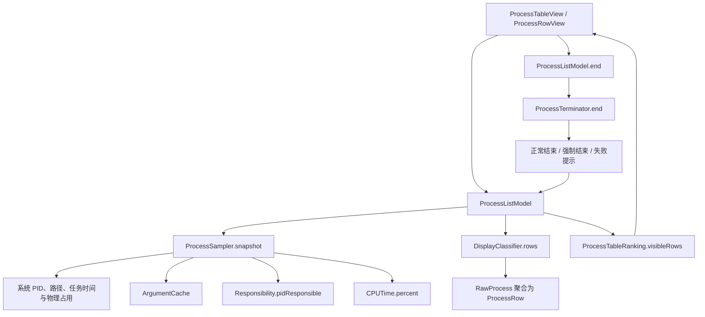
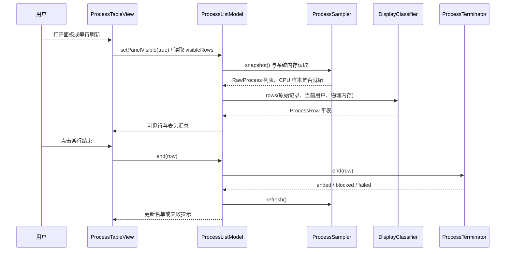

# 实时占用与结束领域知识库

## §0 目录索引

| § | 标题 | 定位 |
|---|---|---|
| §1 | 业务背景与核心概念 | 首次接触实时占用与结束时读 |
| §1.5 | 架构概览 | 快速建立采样、归类、呈现与结束的调用认知 |
| §2 | 核心业务流程 | 理解采样、冻结、排序、钉行与结束的完整链路 |
| §2.5 | 物理路径速查 | 直接定位本域代码和测试 |
| §3 | 代码入口索引 | 按改动场景找到正确入口 |
| §4 | 表与字段入口索引 | 区分内存模型与不存在的业务数据库 |
| §5 | 流程、组件、任务与 MQ 入口索引 | 确认本域没有后台业务编排或消息机制 |
| §6 | 核心业务规则与隐性约束 | 改动前必须扫描的边界与易错点 |
| §7 | 验证路径 | 构建、单测与真实交互验收 |
| §8 | 关联文档 | 跨域修改时联读 |
| §9 | 覆盖度与待补充项 | 了解证据边界与尚未验证项 |

## §1 业务背景与核心概念

**实时占用与结束**是 Mac Resource Monitor 的核心使用链路：用户在菜单栏点开一张极简平表，看到当前哪个责任对象占用整机 CPU 或物理内存，并在允许的边界内结束它。它不是通用的系统监视器，也不提供进程树、子进程展开、历史曲线或远程控制。

本域以一行人能理解的对象为最小交互单位，而不是以 Unix 父子关系或单个 PID 为最小单位。一次展示行可能代表一个桌面应用及其被归入的辅助进程；结束一行时也按该行的成员 PID 集合处理。因此，修改本域时必须同时看采样、归类、排名与结束，不能只改其中一层。

核心概念如下：

| 主称谓 | 实现别名（首次出现） | 业务含义 |
|---|---|---|
| 实时占用与结束 | `ProcessListModel` | 面板可见时维护行名单、整机汇总、排序、冻结、钉行与结束结果的主状态。 |
| 原始进程记录 | `RawProcess` | 单个 PID 的采样结果，保留启动身份、父 PID、用户、路径、参数、责任 PID、CPU 和物理占用。 |
| 展示行 | `ProcessRow` | 用户看到并能操作的平表行；可聚合多个原始进程记录。 |
| 责任进程归类 | `DisplayClassifier` 与 `Responsibility` | 把解释器、桌面应用和已知工具归成用户能够理解的责任对象。 |
| CPU 整机占比 | `CPUTime.percent()` | 一条展示行相对整机逻辑核能力的 CPU 百分比，范围固定为 0–100%。 |
| 行内存占比 | `ProcessRow.memoryPercent` | 该展示行成员物理占用总和除以机器物理内存，不等于系统级内存占用。 |
| 系统内存占比 | `ProcessListModel.systemMemoryPercent` | 系统级物理内存占用，用于表头；不能由展示行内存相加得到。 |
| 列表冻结 | `listFrozen` | 打开后稳住名单顺序与成员，不按占用重排、不插新行；行内占用数字仍刷新。默认关。点列头排序会自动关掉。 |
| 结束行钉位 | `pinnedRowID` / `pinnedIndex` | 鼠标停在一行结束符号上时，保持该行的位置以避免刷新后误杀。 |

`ProcessIdentity` 由 PID 与启动时间组成。缓存和前后 CPU 样本以它为身份，而不只以 PID；这避免 PID 被系统复用时沿用旧参数或旧 CPU 样本。

本域的产品结果只有两件事：让用户一眼认出真正占用者，以及只在安全权限边界内把它结束。所有技术细节都服务于这两个结果。

## §1.5 架构概览



图中的方向代表当前代码的职责流：视图只触发动作和显示状态；`ProcessListModel` 负责协调；采样器获取系统事实；归类器负责把事实变成平表；结束器按行的安全边界实施终止并回到刷新。



## §2 核心业务流程

### 2.1 面板可见、采样与名单更新

1. `ProcessListModel` 初始化时读取冻结开关的本地偏好并启动循环。循环会先进行两次短间隔刷新，之后按项目设定的刷新间隔继续刷新。
2. 面板可见状态由 `ProcessListModel.setPanelVisible()` 接收。变为可见时会立刻请求一次刷新；变为不可见时会清除钉位。
3. `ProcessListModel.refresh()` 用 `isRefreshing` 防止同一时刻并行进入两次刷新。
4. `ProcessSampler.snapshot()` 枚举 PID，并为每个能读取路径的有效 PID 采集原始记录；无法获得路径、PID 非正数或系统调用失败的记录会被跳过。
5. 采样器读取进程启动时刻、父 PID、所属用户、可执行路径、首次缓存的参数、责任 PID、累计 CPU 时间和物理占用。
6. `DisplayClassifier.rows()` 根据责任对象聚合原始记录，并产出默认按 CPU 降序的展示行。
7. 只有在面板可见时才把新采样写入可见 `rows`。未冻结时整表替换；冻结时按原顺序留下仍存活的行并用最新占用数字更新，不插入新行。名单尚空时即使冻结也会先采一拍。
8. 如果钉住的行已经不在新名单中，`refresh()` 会立即清除钉位，不留下不可见的幽灵行。
9. CPU 与系统内存汇总无论名单是否冻结都继续更新，并通过已注册的指标观察者通知菜单栏消费者。

### 2.2 CPU 口径与首次样本

进程 CPU 不是某一瞬间的计数器，而是同一 `ProcessIdentity` 两次采样的累计 user 与 system 时间差，除以两次采样之间的墙钟时间和逻辑核数，再转成百分比。`CPUTime.percent()` 会把结果钳制到 0–100%。

首次看见进程、进程刚重启、墙钟差非正或读不到累计时间时，没有有效前后样本，行 CPU 为 0 且该 PID 不宣告 CPU 样本就绪。`ProcessListModel` 仅在 `snapshot.cpuSampleReady` 为真时更新系统 CPU 汇总；这避免刚采样或瞬时采样失败把菜单栏环错误刷成空。真实的 0% 与“没有有效前后样本”不是同一件事。

在 Apple Silicon 上，累计进程时间以 mach ticks 给出。`CPUTime.nanosecondsPerMachTick` 正常读取系统 timebase；Rosetta 检测到翻译进程或 timebase 分母不可用时使用既定回退比例，随后才换算 CPU 时间。

### 2.3 物理内存口径

每个原始进程记录使用 rusage 的 `ri_phys_footprint` 作为物理占用，并在归类时累加同一展示行成员的字节数。展示行内存百分比为成员物理占用总和除以机器物理内存，并被限制在 0–100%。

表头的系统内存占比走不同路径：`ProcessSampler.memoryUsagePercent` 读取主机 VM 统计，按活动、非活动、有线和压缩页组成已占用，再扣除可回收页的口径，最后除以物理内存。它用于整机事实，不代表平表所有行的加总。行与行之间可能因为归类、不可见项和系统内存口径不同而不能相加。

### 2.4 人话名、责任对象与平表聚合

`ProcessSampler.sample()` 先从 `Responsibility.pidResponsible()` 取得责任 PID。该实现动态查询系统提供的责任 PID 符号；查询不到或返回非正数时安全退回当前 PID。随后 `DisplayClassifier.rows()` 建立 PID 索引并分桶。

归类器的关键分支如下：

- ChatGPT 桌面应用、电脑操控辅助进程和其 memory helper 归为一行 ChatGPT；memory helper 不单独占一行。
- 每个符合 tmux 祖先条件的 Cursor 命令行助手各自独立成行，不与 Cursor.app 混为一行。
- pi 与 Corral 保留人话名，不显示为 node 或 Python。
- 从 Cursor.app 启动的独立具名工具保持独立，不错误折进 Cursor。
- 桌面应用优先按拥有的 `.app` 包聚合；解释器包不会充当拥有者。
- 无法判为上述对象时，具名工具与普通进程各按自己的 PID 成行。

归类时选 CPU 最高的成员作为该行引导记录，用于种类、展示名和图标路径。行 CPU 是成员 CPU 的总和且不超过 100%，行内存是成员物理占用的总和。表永远是平表；聚合关系不向用户展开成树。

### 2.5 可见行、排序、冻结与钉位

`ProcessTableRanking.visibleRows()` 在未冻结时按当前列的数值从高到低排序；相同值用不区分大小写的展示名稳定打破并列。CPU 和内存都是单向降序，重复点同一列不会切换升序。冻结打开时保持快照顺序，不再重排。

可见范围并非无上限：未冻结时，CPU 至少 0.1% 或内存至少 0.4% 的忙碌行达到 8 行时，只显示忙碌行；否则显示排序后的前 12 行。这让刚打开的表避免被大量 0.0% 行占满。冻结时展示冻结当下的可见快照。

冻结开关（界面文案 Freeze / 冻结，默认关）打开时，`rows` 保持冻结当下的顺序：仍存活的行用最新占用数字原位更新，已消失的行拿掉，新进程不插进来；表头整机指标与行内数字都继续刷。点可排序列头会调用 `selectSort`：关掉冻结并按该列排序。面板收起后，进程表名单不再覆盖更新，钉位也会清除。

当鼠标进入一行结束符号，`ProcessListModel.setEndHover(true,rowID:)` 先算出当前可见索引，再记录该行 ID 与索引。后续刷新仍使用新的对象和最新占用数，但排名器把这行插回原位置。鼠标离开后有短暂延迟再解除，以避免在控件边界抖动；若悬停行已消失，刷新会立即解除。钉位只属于结束符号，不是整张表冻结。

**【踩坑 2026-09-06】** 不可在已对 `pinnedRowID` 做 `inout` 独占借用时，再经 `@Observable` 的 `visibleRows` 回读同一钉位属性：Swift 独占冲突会直接 SIGABRT（系统报告 `_swift_reportExclusivityConflict`）。网络表结束钮悬停曾因此闪退；进程表同源。调用方必须先算好索引，再进入钉位状态机。

### 2.6 结束安全边界与终止顺序

`ProcessTableView` 将每行的结束动作交给 `ProcessListModel.end()`，后者清除旧错误、调用 `ProcessTerminator.end()`，仅将失败结果写入 `lastError`，然后无条件刷新。

结束器先阻止两类行：系统保护行，以及任何成员并非当前用户的行。被阻止是预期安全结果，不显示为执行失败。同一批成员身份若已有结束进行中（含网络表与进程表交叉），再次结束返回阻止，避免并发发信号。

允许结束的桌面应用和 ChatGPT 行先按运行中的应用执行正常终止；短暂等待后，对仍未结束的应用强制终止；最后再对该行成员走解释器终止流程。Cursor Agent、pi、Corral、具名工具和普通进程直接走解释器终止流程：先向仍存活且启动时刻仍匹配的成员发 SIGTERM，等待，再向仍匹配的成员发 SIGKILL。每发信号前复读路径并跳过系统保护目标。结束后再次按 PID+启动时刻检测成员是否存活；都已消失才是 `ended`，否则将本地化失败文案交给表内提示。

### 2.7 表内呈现与可访问性

`ProcessTableView` 只渲染 `model.visibleRows`，顶部放冻结开关、CPU/内存汇总列和不可排序的结束列占位。未冻结时当前排序列为主色，另一列为次要色；冻结时列头都不强调排序。每行由 `ProcessRowView` 显示图标、人话名、CPU、内存和结束符号。

结束符号是简洁的关闭图标，而不是文字按钮；仅在可结束且悬停时变红。系统保护或非当前用户行的控件禁用并给出对应帮助说明。行的无障碍文案包含人话名、CPU 与内存百分比；按钮也有无障碍名称和限制原因。

## §2.5 物理路径速查

| 目录（相对 app-macos 项目根） | 内容 | 关键类/文件数 |
|---|---|---|
| `MacResourceMonitor/Services/` | PID 采样、CPU 与内存口径、参数缓存、责任 PID、归类、主状态与结束 | `ProcessSampler`、`CPUTime`、`ArgumentCache`、`Responsibility`、`DisplayClassifier`、`ProcessListModel`、`ProcessTerminator`，7 个文件 |
| `MacResourceMonitor/Models/` | 原始记录、展示行、行种类和排序列内存模型 | `ProcessRow.swift`，1 个文件 |
| `MacResourceMonitor/Views/` | 进程表表头、排序触发、行呈现、结束触发和悬停钉位入口 | `ProcessTableView.swift`、`ProcessRowView.swift`，2 个文件 |
| `MacResourceMonitorTests/` | 排名、钉位、归类、系统保护和 CPU 上限的回归测试 | `ProcessTableRankingTests.swift`、`DisplayClassifierTests.swift`，2 个文件 |
| `docs/` | 本域产品行为权威契约及本知识库 | `PRODUCT_CONTRACT.md` 与本文件，2 个文件 |

## §3 本域代码入口索引

| 场景 | 入口 | 类/方法/配置 | 说明 |
|---|---|---|---|
| 修改面板是否更新名单、刷新循环或表头指标 | 主状态协调 | `MacResourceMonitor/Services/ProcessListModel.swift` · `ProcessListModel.refresh()`、`start()`、`setPanelVisible()` | 采样、名单覆盖、系统汇总、钉位失效和错误回显的汇合点。 |
| 修改 PID 枚举、进程身份、CPU 或物理内存采样 | 系统采样 | `MacResourceMonitor/Services/ProcessSampler.swift` · `ProcessSampler.snapshot()`、`sample()` | 逐 PID 获取原始记录并维护前后 CPU 样本。 |
| 修改 CPU 数学口径或 Rosetta 回退 | CPU 换算 | `MacResourceMonitor/Services/CPUTime.swift` · `CPUTime.percent()` | 将累计 mach ticks 的差转为整机逻辑核百分比。 |
| 修改启动参数缓存或 PID 复用保护 | 参数缓存 | `MacResourceMonitor/Services/ArgumentCache.swift` · `arguments(for:)`、`prune(keeping:)` | 参数按 PID 与启动时间缓存，随存活身份清理。 |
| 修改责任 PID 取得方式 | 系统责任归属 | `MacResourceMonitor/Services/Responsibility.swift` · `pidResponsible(for:)` | 动态读取责任 PID，失败时退回当前 PID。 |
| 修改人话名、聚合规则、系统保护或结束按钮是否锁定 | 展示归类 | `MacResourceMonitor/Services/DisplayClassifier.swift` · `rows()`、`makeRow()`、`isProtected()` | 负责从原始记录产生平表和安全标记。 |
| 修改默认排名、忙碌阈值、可见数量或钉位插入 | 表内排名 | `MacResourceMonitor/Services/ProcessListModel.swift` · `ProcessTableRanking.visibleRows()` | CPU/内存均为降序，钉行仍用更新后的数值。 |
| 修改结束权限、正常结束、强制结束或失败判断 | 终止执行 | `MacResourceMonitor/Services/ProcessTerminator.swift` · `ProcessTerminator.end()` | 依据行种类与安全标记结束成员 PID。 |
| 修改表头、冻结开关或排序点击 | 表格视图 | `MacResourceMonitor/Views/ProcessTableView.swift` · `ProcessTableView.body`、`sortHeader()` | 连接主状态与表头互动，不承担采样计算。 |
| 修改结束图标、禁用状态、悬停或行内视觉 | 行视图 | `MacResourceMonitor/Views/ProcessRowView.swift` · `endButton`、`helpText()` | 只把当前行状态映射到 UI 与回调。 |
| 修改归类、保护和口径后的回归保护 | 分类测试 | `MacResourceMonitorTests/DisplayClassifierTests.swift` | 覆盖 ChatGPT、Cursor Agent、pi、Corral、独立工具、保护行和 CPU 上限。 |
| 修改排序、空闲筛选或钉位后的回归保护 | 排名测试 | `MacResourceMonitorTests/ProcessTableRankingTests.swift` | 覆盖 CPU/内存降序、忙碌筛选、百分比格式和钉位更新。 |

## §4 本域表与字段入口索引

本域没有业务数据库、数据表、ORM、迁移或可查询的持久化字段。所有数据都是本机采样后的内存模型，不能把下表误认为数据库 schema。

| 内存模型 / 属性 | 定义位置 | 业务语义 | 改动注意 |
|---|---|---|---|
| `RawProcess.identity` | `MacResourceMonitor/Models/ProcessRow.swift` | PID 与启动时间的复合身份 | 用于防 PID 复用；不能将参数缓存或 CPU 历史只按 PID 键控。 |
| `RawProcess.ppid` 与 `responsiblePID` | `MacResourceMonitor/Models/ProcessRow.swift` | Unix 父关系与系统责任关系 | 两者都用于归类线索，但产品结果是平表，不应改成父子树。 |
| `RawProcess.cpuPercent` | `MacResourceMonitor/Models/ProcessRow.swift` | 单个 PID 的整机逻辑核 CPU 占比 | 由前后采样差计算，不是累计时间或单核百分比。 |
| `RawProcess.memoryBytes` | `MacResourceMonitor/Models/ProcessRow.swift` | 单个 PID 的物理占用字节数 | 使用 physical footprint；不要改成 resident 口径。 |
| `ProcessRow.memberIdentities` / `memberPIDs` | `MacResourceMonitor/Models/ProcessRow.swift` | 一行包含的成员身份；`memberPIDs` 为派生只读视图 | 结束与存活检测必须用身份；禁止只按 PID 发 SIGKILL。 |
| `ProcessRow.cpuPercent` 与 `memoryPercent` | `MacResourceMonitor/Models/ProcessRow.swift` | 行级 CPU 与行级物理内存百分比 | 行内存不是系统内存；表头内存不能由它累加。 |
| `ProcessRow.kind` | `MacResourceMonitor/Models/ProcessRow.swift` | 行种类，决定显示与结束策略 | 改新种类时必须同步归类器、结束器和测试。 |
| `ProcessRow.isCurrentUser` 与 `isSystemProtected` | `MacResourceMonitor/Models/ProcessRow.swift` | 结束是否被允许的安全状态 | 视图禁用与结束器二次拦截都必须保留。 |

## §5 流程、组件、任务与 MQ 入口索引

本域没有业务流程引擎、定时任务框架、MQ、网络服务、数据库持久化流程或跨进程任务队列。刷新循环是进程内的异步任务，不是可配置的后台作业；它只在 `ProcessListModel.start()` 中创建并由 `stop()` 取消。

| 类型 | 标识 | 代码入口 | 适用场景 |
|---|---|---|---|
| 进程内刷新循环 | `listLoop` | `MacResourceMonitor/Services/ProcessListModel.swift` · `start()`、`stop()` | 维护面板名单与系统汇总的周期性采样。 |
| 主线程状态协调 | `@MainActor` 主状态 | `MacResourceMonitor/Services/ProcessListModel.swift` | 把异步采样、行列表和 UI 可观察状态安全地汇合。 |
| 隔离采样器 | `actor ProcessSampler` | `MacResourceMonitor/Services/ProcessSampler.swift` | 维护跨采样的 CPU 历史与参数缓存调用。 |
| 隔离参数缓存 | `actor ArgumentCache` | `MacResourceMonitor/Services/ArgumentCache.swift` | 避免每一拍反复读取同一进程参数。 |

## §6 核心业务规则与隐性约束

- 【叫法统一】正文中的“实时占用与结束”对应 `ProcessListModel` 协调的采样、平表、排名与结束链路；不要把它缩成“进程列表”后遗漏结束、安全或系统汇总。
- **AI 易错点**【禁止】把 CPU 改成单核或累计 CPU 时间 -> 必须保持两次采样的 Δ(user+system) / (墙钟秒 × 逻辑核数) × 100，并限制在 0–100%（原因：产品展示的是整机逻辑核占比，且与菜单栏指标同口径）。
- **AI 易错点**【禁止】将每一行 `memoryPercent` 相加写进表头 -> 必须继续读取系统级物理内存占比（原因：行模型是可见责任对象的 physical footprint 聚合，无法代表整机已占用内存）。
- **AI 易错点**【禁止】用 PID 单独作为缓存或 CPU 历史身份 -> 必须使用 PID 加启动时间的 `ProcessIdentity`（原因：PID 会复用，旧参数和旧样本会错误附着到新进程）。
- **AI 易错点**【禁止】结束流程只按 PID 发 SIGTERM/SIGKILL -> 必须在等待前后用启动时刻核对仍是同一进程，并跳过仍被判为系统保护的目标（原因：等待窗口内 PID 复用或误折进应用行的系统助手会被误杀）。
- **AI 易错点**【禁止】把系统保护进程按责任 PID 折进桌面应用行 -> `rowKey` 必须让保护进程独立成行（原因：结束应用时的成员信号会连带打到系统助手）。
- **AI 易错点**【禁止】把 argv0 等于可执行短名当成「具名工具」hint -> `toolHint` 必须跳过该情况（原因：WindowServer 等短名会误放开分类边界）。
- **AI 易错点**【禁止】从 Unix 父子关系直接画进程树或把一切孩子都折叠 -> 必须通过责任 PID、包路径、参数和明确的家族规则形成平表（原因：产品不做进程树，且 Cursor 启动的独立工具不能被折进 Cursor）。
- **AI 易错点**【禁止】只在按钮上禁用系统行或其他用户行 -> 必须同时保留 `ProcessTerminator.end()` 的二次拦截（原因：UI 只是入口，结束器仍是最后的权限边界）。
- **AI 易错点**【禁止】把 ChatGPT、电脑操控与其 memory helper 拆成多行 -> 必须聚合为一行 ChatGPT（原因：用户需要看到责任对象，结束这一行的业务含义就是结束这一家）。
- **AI 易错点**【禁止】把每个 Cursor Agent 聚合为 Cursor.app，或结束 Corral 时顺手结束 tmux -> 必须保留各 Cursor Agent 的独立行、Corral 的现有成员边界（原因：结束必须只影响用户点击的责任对象）。
- **AI 易错点**【禁止】刷新时冻结整张表或仅保存钉住行的旧值 -> 必须只钉结束符号悬停的那一行的位置，并使用新采样的行对象和数值（原因：防误杀不能牺牲其他占用信息的实时性）。
- **AI 易错点**【禁止】悬停行消失后继续保留钉位 -> 必须在 `refresh()` 发现 ID 不存在时立即清除（原因：否则会产生幽灵行或错误插入位置）。
- 【隐性依赖】修改行种类或保护判定前必须同时检查 `DisplayClassifier.makeRow()`、`ProcessTerminator.end()`、`ProcessRowView.endButton` 和分类测试，否则会出现“视觉上可结束但实际阻止”或相反的边界分裂。
- 【隐性依赖】修改冻结开关前必须同时检查名单更新与系统汇总通知；开关冻结的是名单，表头 CPU/内存和菜单栏指标仍应刷新。点列头必须关冻结。
- 【隐性依赖】修改 Apple Silicon 或 Rosetta 的 CPU 采样时必须同时检查 ticks 到纳秒的换算与逻辑核归一化；只换墙钟时间会让数值失真。
- 【隐性语义】`ProcessListModel.refresh()` 对 `isRefreshing` 的保护使同一时刻只允许一个刷新；新增异步入口时不要绕开它并直接覆写 `rows`。
- 【隐性语义】`ArgumentCache` 仅在某一 `ProcessIdentity` 第一次出现时读取参数，并在快照完成后按存活身份清理；新增参数识别规则不能改成每秒读取全机参数。
- 【禁止】将系统保护只按展示名称判断 -> 必须保留 PID、保护名称和系统路径三类保护线索，且路径须覆盖 `/System/`、`/usr/libexec/`、`/usr/sbin/`、`/sbin/`（原因：WindowServer 等短名可能被误判为普通具名工具；`/usr/sbin` 不在旧前缀里）。
- 【禁止】把失败的结束结果吞掉 -> 必须让 `ProcessListModel.end()` 写入本地化失败信息并刷新（原因：用户需要知道仍有成员存活，而不是误以为已结束）。
- 【消歧】行内存占比 vs 系统内存占比：前者属于 `ProcessRow`，是可见责任对象成员的 physical footprint；后者属于 `ProcessListModel`，是 host VM 的整机口径。两者不能互传或相加。
- 【消歧】列表冻结 vs 结束行钉位：前者冻结整份名单以便用户定位；后者只在结束符号悬停期间保持一行位置，数值依旧刷新。两者不可互相替代。

## §7 常见易忽略条件与验证路径

### 编译与定向单测

在 `app-macos/` 执行以下命令。若改动涉及工程文件，先执行 `xcodegen generate`，因为 `project.yml` 是工程的唯一来源。

```bash
xcodebuild -project MacResourceMonitor.xcodeproj -scheme MacResourceMonitor -destination 'platform=macOS' test -only-testing:MacResourceMonitorTests/ProcessTableRankingTests
```

检查：CPU 与内存均降序；忙碌筛选不让空闲行挤占首屏；百分比保持一位小数；钉住行保留原位置、采用新数值、消失时没有幽灵行。

```bash
xcodebuild -project MacResourceMonitor.xcodeproj -scheme MacResourceMonitor -destination 'platform=macOS' test -only-testing:MacResourceMonitorTests/DisplayClassifierTests
```

检查：ChatGPT 家族聚合、Cursor Agent 独立、pi/Corral 人话名、Cursor 启动的独立工具不被折叠、系统保护和 CPU 上限均不回退。

```bash
xcodegen generate && xcodebuild -project MacResourceMonitor.xcodeproj -scheme MacResourceMonitor -configuration Release -derivedDataPath build/DerivedData -destination 'platform=macOS' build
```

检查：Release 产物可构建；本域的 Swift 并发隔离和系统 API 调用没有被改坏。

### 真实交互验证

本域的完成标准不能只靠单测。安装并实际打开菜单栏表后，至少逐项确认：

1. 打开时首行紧贴顶栏，能看到图标、人话名、CPU、内存与结束符号组成的平表；没有进程树或展开入口。
2. 表头 CPU 与内存均显示整机汇总；关闭刷新后名单停住，但表头汇总仍随时间变化；收起面板后名单不在后台更新。
3. 分别点击 CPU 和内存列，顺序只会从高到低切换；再次点击同一列不出现升序。
4. 将鼠标停在某行结束符号上并等待刷新，该行保持位置但数字可更新；移开或行消失后，排序恢复且无幽灵行。
5. 选择一个明确属于当前用户、可安全结束的测试进程，确认先正常结束、必要时强制结束，随后名单刷新；不要把系统进程、其他用户进程或重要工作进程当验收样本。
6. 验证系统保护行和其他用户行的结束符号不可用，并显示正确限制说明。

真实菜单栏呈现和真实结束操作尚待每次影响本域的改动当次验证；本知识库不把历史构建或单测当成替代证据。

## §8 关联文档

- [产品契约](PRODUCT_CONTRACT.md)：涉及人话名、整机 CPU/内存口径、冻结开关、排序、钉行、结束边界或用户可见表格行为时联读；它是用户可见行为的权威来源。
- [菜单栏操作与恢复领域知识库](MENU_BAR_INTERACTION_KNOWLEDGE_BASE.md)：菜单栏域通过 `AppDelegate.listModel`、`CompactPanel` 和 `StatusItemController` 消费本域的系统汇总与显示状态。改面板唤出、可见状态或菜单栏显示时联读；不在本域重写左右键、隐藏或恢复窗口规则。
- [安装、更新与公开发布领域知识库](DISTRIBUTION_AND_UPDATE_KNOWLEDGE_BASE.md)：本域没有运行时依赖；当修改影响构建、签名、安装或公开发版时可选联读。
- [macOS 进程身份知识库](~/.config/agentsync/docs/MAC_PROCESS_IDENTITY_KNOWLEDGE_BASE.md)：改责任进程、人话名或 CPU 口径前联读，避免以 Unix 父子树替代责任对象。

## §9 覆盖度与待补充项

- 代码推断覆盖：已覆盖 PID 采样、CPU/物理内存口径、参数缓存、责任 PID、平表聚合、默认排序与可见范围、刷新冻结、结束行钉位、结束权限与终止顺序、表内触发和相关测试。
- 领域语言统一：正文统一使用“实时占用与结束”；首次保留 `ProcessListModel`、`ProcessSampler`、`DisplayClassifier`、`ProcessRow` 等实现别名。行内存和系统内存已明确消歧。
- 用户 / 资料补充：缺少用户经验输入；用户明确表示没有额外需求说明、发布说明、验收记录、历史兼容行为或隐藏约束可供补强。
- 多源证据补强：已读取产品契约、实现入口、表格与行视图、排名与归类测试；Git 历史仅提供“CPU 环采样闪空”和“结束符号钉行”的弱信号，未单独作为规则来源。
- Q&A 补充：用户没有提供额外隐性约束；本文件只记录代码、测试和产品契约直接支持的事实。
- 数据库证据：本域无业务数据库、表、字段或真实数据口径，未进行数据库挖掘。
- 运行时证据：运行时实际交互尚待当次验证；尚未把本次文档生成当成已完成的菜单栏视觉或真实结束验收。
- 待补充：若未来出现权限拒绝、受保护系统路径差异、特殊解释器家族或真实结束失败，应在复现后用 doc-update 补充触发条件、用户影响、禁止误修路径和实跑证据。

### 当前证据逐项边界

| 结论范围 | 已有直接证据 | 尚未替代的证据 |
|---|---|---|
| CPU 整机口径 | `CPUTime.percent()`、采样实现与 CPU 上限测试 | 真机在原生与 Rosetta 场景的当次读数对照。 |
| 行级物理内存 | `ProcessSampler.physicalFootprint()` 与展示行聚合实现 | 真机不同进程类型的实际数值抽样。 |
| 系统内存表头 | `ProcessSampler.readMemoryUsagePercent()` 与产品契约 | 当次菜单栏和表头同拍的视觉对照。 |
| 人话名 | 归类器实现和 ChatGPT、Cursor、pi、Corral 测试 | 未覆盖的新解释器、工具或桌面应用家族。 |
| 系统保护 | `isProtected()` 和 WindowServer 测试 | 未来 macOS 新增的受保护进程与路径。 |
| 结束顺序 | `ProcessTerminator.end()` 的正常、强制与信号流程 | 对每一种真实进程种类的无破坏性人工验收。 |
| 排名与钉位 | `ProcessTableRanking` 与排名测试 | 快速多次刷新下的真实鼠标悬停体验。 |
| 表内呈现 | 两个 SwiftUI 视图的代码 | 不同显示设置、语言和辅助功能环境的截图验收。 |

### 后续维护触发词

- 用户说“CPU 数字不对”“双环闪空”“刚打开全是 0.0%”时，先检查采样身份、前后样本、CPU ticks 换算和指标通知。
- 用户说“内存总数对不上”“开机就六十多”“行内存加不起来”时，先区分行级 physical footprint 与系统级 VM 口径。
- 用户说“显示成 node / Python”“ChatGPT 被拆开”“Cursor Agent 不见了”时，先检查参数缓存、责任 PID 和归类器家族分支。
- 用户说“结束不了”“不该能结束”“点错行”时，先检查当前用户、系统保护、成员 PID、钉位和结束后的存活检测。
- 用户说“刷新关了还在跳”“悬停结束时位置变了”时，先检查名单覆盖条件与钉位的失效和插入逻辑。

<!-- 该文档整理/压缩于 2026-09-05 -->
